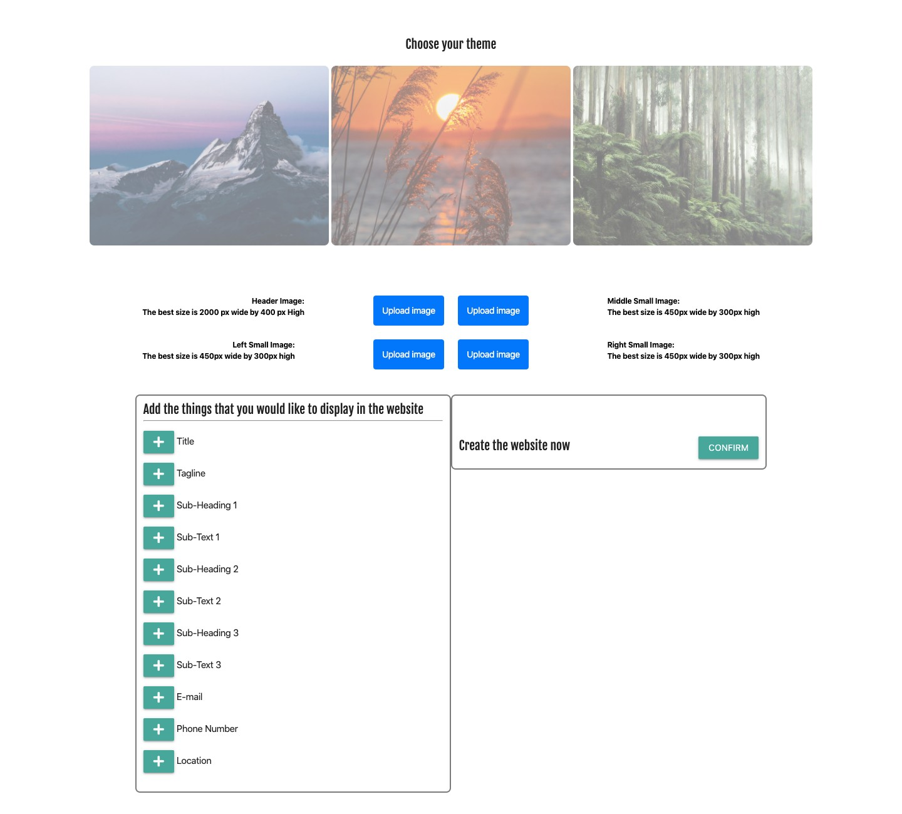

# One Page Man - Single Page Website Generator 💻

**Deployed Link:** [https://thawing-inlet-42364.herokuapp.com/](https://thawing-inlet-42364.herokuapp.com/)

## Introduction
This web-based application is the simplest way to create a stunning static webpage. 

## How to use
The user is provided with three colour themes to choose from, helpfully illustrated by the scenic images. There are four buttons to allow the upload of a header image, and three smaller images. Then the user can choose which elements they wish to add to the page, and enter the text for those elements. Then a simple click provides them with a URL to view their page. 

The images uploaded by the user are saved on the third-party site Cloudinary. The URL to the images, along with the theme chosen by the user and the text entered by the user create a new model that is saved to the database. When the user (or anyone else) puts the URL they receive into their browser the application reads the ID part of the URL, retrieves the relevant entry from the database and inserts that information into the page template.

The webpages are created with the CSS framework Materialize. The pages deployed to the user are created dynamically using Handlebars. Sequelize was used to send and retrieve data from the MySQL database. The Express framework was used to handle HTML and API routes. User images are uploaded via a widget provided by Cloudinary. 

---
### Deployed Page

### Acknowledge
- Sequelize
- MySql
- Cloudinary
- Handlebars
- Materialize

**Contributors:** 
* [James Pearce](https://github.com/JEQP) - Backend (Database, Sequelize, Data Manipulation)
* [Simon Colman](https://github.com/sijbc) - Backend (Routes, MVP, folder and file structure)
* [Sherry Jin](https://sherryj-sk.github.io/) - Frontend (HTML, CSS, JavaScript)

